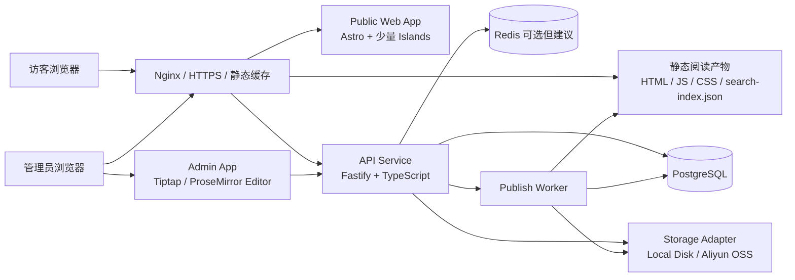
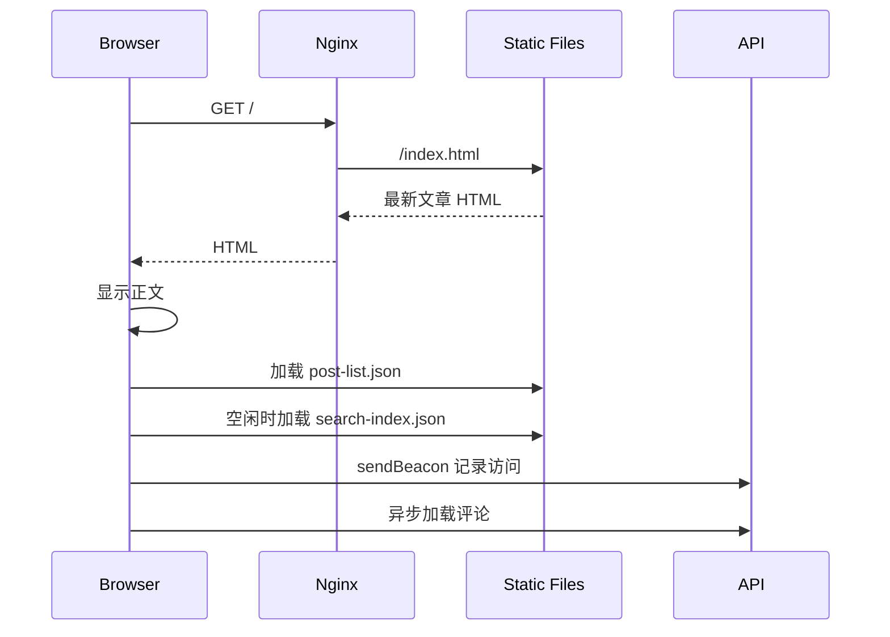
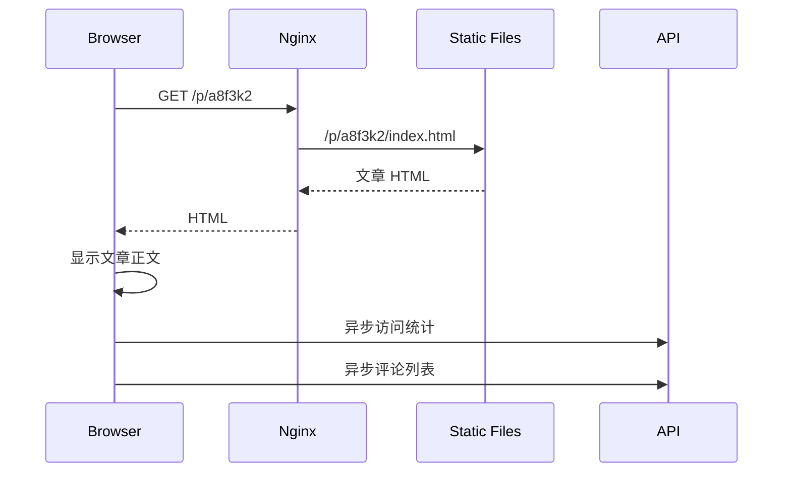
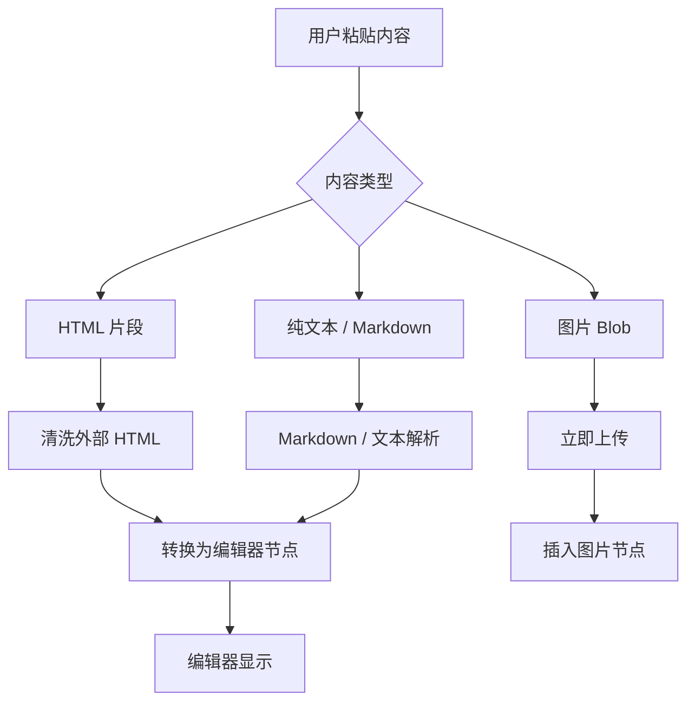
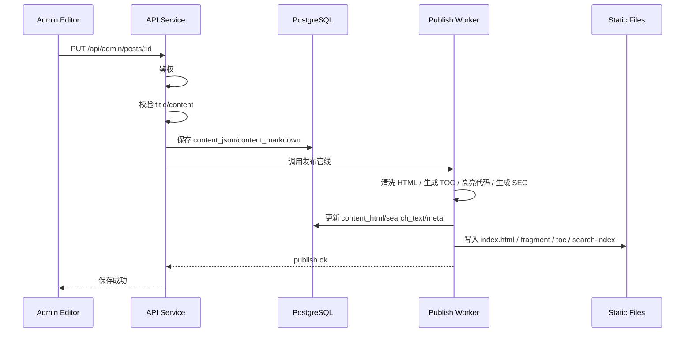
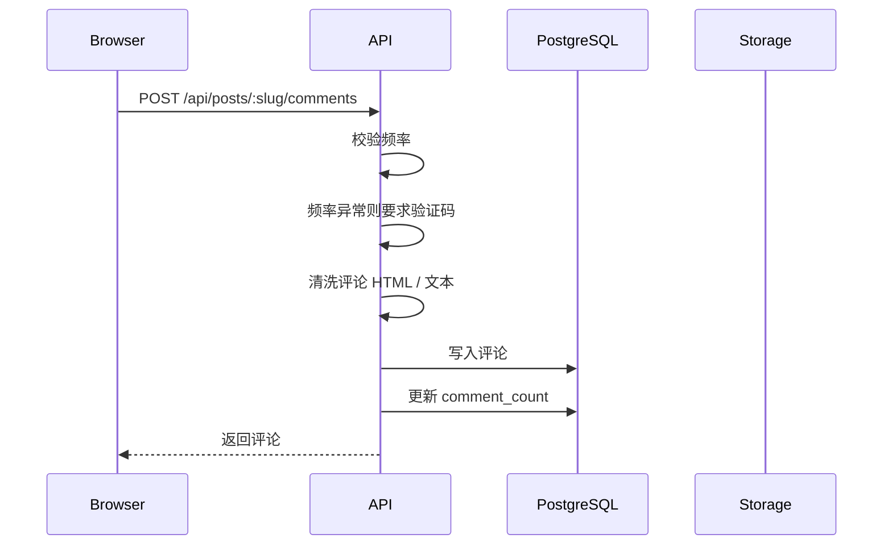

# FreedomPost 架构设计与软件开发详细设计

版本：v0.1  
定位：个人内容平台 / 单页阅读器 / 轻量 CMS  
优先级：极致阅读性能 > 内容自由发布 > 后台编辑效率 > 扩展能力

---

## 1. 设计结论

FreedomPost 不应按传统“动态博客系统”实现，而应采用 **读写分离 + 写入时生成静态阅读产物** 的架构。

核心原则：

```text
管理员写入：后台富文本编辑 → 服务端清洗 → 生成静态阅读产物 → 更新搜索索引
访客阅读：Nginx/静态文件直接返回 HTML/JSON → 前端极少 JS 接管 → 评论异步加载
```

这套架构的关键收益：

1. 文章阅读不依赖实时数据库查询。
2. 文章正文、目录、代码高亮、SEO 元信息全部在保存时预生成。
3. 访客访问文章时优先走 Nginx 静态文件，后端 API 只处理评论、访问统计、后台管理。
4. 管理后台和前台阅读器解耦，重型编辑器不会污染访客阅读性能。
5. 后续可把静态阅读产物同步到 OSS/CDN 或境外节点。

---

## 2. 总体架构

## 2.1 架构图



---

## 2.2 服务划分

| 服务 | 职责 | 性能要求 |
|---|---|---|
| Nginx | HTTPS、反向代理、静态文件服务、压缩、缓存 | 极高，前台读路径优先命中 Nginx |
| Public Web | 前台阅读 shell、文章路由、SEO HTML 输出 | 极轻量，尽量少水合 |
| API Service | 登录、文章管理、评论、上传、访问统计 | 低延迟，接口清晰 |
| Publish Worker | 保存文章后的渲染、清洗、索引重建、静态产物生成 | 异步或同步均可，先保证一致性 |
| PostgreSQL | 源数据存储 | 强一致，结构化数据 |
| Redis | 限流、热计数、短期缓存 | 可选，性能优先建议启用 |
| Storage Adapter | 本地磁盘 / 阿里云 OSS 文件存储 | 上传稳定，支持大文件 |

---

## 3. 技术选型

## 3.1 推荐技术栈

| 层级 | 推荐 | 原因 |
|---|---|---|
| 前台阅读器 | Astro + Vanilla TS / Preact Islands | 默认输出静态 HTML，按需水合交互组件，降低 JS 负担 |
| 管理后台 | Vite + React + Tiptap | 编辑器复杂，单独打包，避免影响前台 |
| 富文本编辑 | Tiptap + ProseMirror | 开源成熟，适合构建类语雀/飞书/Notion 编辑体验 |
| Markdown / 内容转换 | Tiptap JSON + Markdown 导出 + HTML 预渲染 | 兼顾富文本粘贴、Markdown 兼容、阅读性能 |
| API | Fastify + TypeScript | 低开销、插件生态成熟 |
| ORM | Drizzle ORM | TypeScript 类型安全、轻量、贴近 SQL |
| 数据库 | PostgreSQL | 关系型数据、递归评论、全文字段、事务一致性 |
| 搜索 | FlexSearch 前端本地索引 | 前台无网络搜索，标题权重高，响应快 |
| 代码高亮 | Shiki 写入时预生成 | 不在浏览器运行高亮器，减少运行时 JS |
| HTML 清洗 | DOMPurify / sanitize-html | 防 XSS，允许富文本但清除危险内容 |
| 上传 | 阿里云 OSS + 本地磁盘适配器 | 开发本地，生产 OSS |
| 部署 | Docker Compose + Nginx + GitHub Actions | 与现有阿里云服务器匹配，复杂度可控 |
| HTTPS | Let’s Encrypt / acme.sh / certbot | 自动签发与续期 |

---

## 3.2 为什么不建议纯 Next.js 做全部功能

Next.js 可以实现，但对本项目不是最优解：

1. 访客阅读器不需要大型 React 应用。
2. 管理后台才需要重型交互，前台只需要列表、目录、搜索、评论。
3. 极致性能要求下，前台应尽量静态 HTML + 极少 JS。
4. 文章保存后生成静态产物，比每次请求时 SSR 更稳定。

如后续团队更熟悉 Next.js，也可以采用 Next.js App Router 实现，但必须遵守：

- 管理后台单独 chunk。
- 阅读页面尽量 Server Component。
- 评论、搜索、目录等局部交互组件延迟水合。
- 不把编辑器依赖打进前台阅读 bundle。

---

## 4. 核心性能架构

## 4.1 读写分离

### 写路径

```text
管理员保存文章
  → API 接收 Tiptap JSON / Markdown / 附件引用
  → 服务端 HTML 清洗
  → 生成阅读 HTML
  → 生成目录 TOC
  → 生成纯文本 search_text
  → 生成代码块高亮 HTML
  → 生成 SEO metadata
  → 写入 PostgreSQL
  → 写入静态产物文件
  → 重建 search-index.json
  → 返回保存成功
```

### 读路径

```text
访客访问 /p/a8f3k2
  → Nginx 命中静态 HTML
  → 浏览器立即显示文章正文
  → JS 异步加载文章列表、搜索索引、评论
  → sendBeacon 异步记录访问量
```

---

## 4.2 静态阅读产物

每篇文章保存后生成以下文件：

```text
runtime/public/
├─ index.html                         # 最新文章入口
├─ p/
│  └─ a8f3k2/
│     ├─ index.html                   # SEO 完整文章页
│     ├─ article.fragment.html        # 前端无刷新切换用正文片段
│     ├─ article.meta.json            # 标题、时间、阅读数等
│     └─ toc.json                     # 当前文章目录
├─ search/
│  ├─ post-list.json                  # 左侧列表元数据
│  ├─ search-index.json               # 前端搜索索引
│  └─ search-docs.json                # 搜索结果展示元数据
└─ assets/
   ├─ app.[hash].js
   └─ app.[hash].css
```

这样做的理由：

- 首次访问文章直接返回完整 HTML，利于 SEO。
- 前端文章切换只拉取 `article.fragment.html`，体积小，渲染快。
- TOC 不在浏览器临时解析，节省前端计算。
- 搜索索引单独版本化，浏览器可缓存。

---

## 4.3 前台 JS 控制原则

前台 JS 只负责：

1. 左侧搜索。
2. 点击文章后无刷新切换。
3. 目录折叠 / 展开。
4. 文章列表栏拖拽宽度。
5. 评论异步加载与提交。
6. 复制链接。
7. 亮暗主题切换。

不在前台 JS 中做：

- Markdown 渲染。
- 代码高亮。
- 复杂富文本解析。
- 大量 DOM 重排。
- 编辑器加载，除非管理员进入编辑模式。

---

## 4.4 性能预算

第一版建议目标：

| 指标 | 目标 |
|---|---|
| HTML 首字节 TTFB | 同机房 / 国内网络下尽量 < 100ms |
| 首屏正文可见 | 尽量 < 800ms |
| 阅读页 JS gzip 体积 | 尽量 < 80KB |
| 首屏 CSS gzip 体积 | 尽量 < 30KB |
| 缓存命中文章切换 | < 50ms |
| 未缓存文章切换 | < 200ms，取决于网络 |
| 搜索响应 | < 100ms |
| 评论加载 | 不阻塞正文，异步完成 |

硬性原则：

- 正文优先于评论。
- 正文优先于搜索索引。
- 正文优先于社交链接。
- 正文优先于访问统计。
- 管理后台永远不能影响访客阅读 bundle。

---

## 4.5 缓存策略

### 静态资源

```http
Cache-Control: public, max-age=31536000, immutable
```

适用：

- JS
- CSS
- 图片缩略图
- hash 命名附件
- search-index.[hash].json

### 文章 HTML

```http
Cache-Control: public, max-age=60, stale-while-revalidate=600
```

或如果采用文件 hash + 发布时覆盖，可以使用更长缓存，但需要注意文章保存后的即时可见性。

### 评论接口

```http
Cache-Control: no-store
```

评论需要实时性，不建议静态缓存。

### 后台接口

```http
Cache-Control: no-store
```

后台所有接口不缓存。

---

## 5. 前台阅读器详细设计

## 5.1 前台模块

```text
frontend/public-reader/
├─ ShellLayout
├─ ArticleListPanel
├─ SearchBox
├─ TocPanel
├─ ArticleViewer
├─ CommentSection
├─ FooterLinks
├─ ThemeToggle
└─ AdminInlineEditEntry
```

---

## 5.2 页面启动流程

### 访问 `/`



### 访问 `/p/:slug`



---

## 5.3 文章切换设计

点击左侧文章标题：

```text
1. 阻止浏览器整页跳转
2. history.pushState('/p/:slug')
3. 立即检查 memory cache
4. 命中：直接替换 ArticleViewer HTML
5. 未命中：fetch article.fragment.html
6. 替换正文区域
7. 替换标题、时间、阅读量、评论数
8. 加载 toc.json
9. 异步加载评论
10. 异步记录访问量
```

缓存策略：

```ts
interface ArticleCacheItem {
  slug: string
  html: string
  toc: TocItem[]
  meta: ArticleMeta
  cachedAt: number
}
```

前端维护：

- `Map<string, ArticleCacheItem>` 内存缓存。
- 当前文章必须缓存。
- 鼠标 hover 文章标题时预取。
- 搜索结果第一条立即预取。
- 浏览器空闲时预取列表前 3-5 篇。

---

## 5.4 搜索设计

### 搜索数据

`post-list.json`：

```json
[
  {
    "slug": "a8f3k2",
    "title": "文章标题",
    "updatedAt": "2026-07-02T10:00:00.000Z",
    "viewCount": 128,
    "commentCount": 12
  }
]
```

`search-index.json`：

```json
{
  "version": "hash",
  "engine": "flexsearch",
  "documents": [
    {
      "id": "a8f3k2",
      "title": "文章标题",
      "body": "纯文本正文..."
    }
  ]
}
```

### 排名规则

搜索时分两段执行：

```text
第一段：标题索引搜索
第二段：正文索引搜索
合并：标题结果在前，正文结果在后，去重
```

伪代码：

```ts
function search(query: string): SearchResult[] {
  const titleHits = titleIndex.search(query)
  const bodyHits = bodyIndex.search(query)

  return dedupe([
    ...titleHits.map(hit => ({ ...hit, source: 'title', scoreBoost: 1000 })),
    ...bodyHits.map(hit => ({ ...hit, source: 'body', scoreBoost: 0 }))
  ]).sort(byFinalScore)
}
```

中文搜索建议：

- 保存索引时生成中文 char bigram / trigram。
- 同时保留原文。
- 可使用 `Intl.Segmenter` 做词切分，但不能完全依赖它。
- 标题索引单独维护，确保标题优先。

---

## 5.5 文章目录设计

TOC 在保存文章时生成：

```ts
interface TocItem {
  id: string
  text: string
  level: 1 | 2 | 3 | 4 | 5 | 6
  children?: TocItem[]
}
```

要求：

- 默认展开。
- 宽度 240px。
- 折叠后 40px。
- 折叠按钮醒目。
- 点击目录滚动到对应标题。
- 当前滚动位置高亮对应目录项。

前端滚动监听使用 IntersectionObserver，避免高频 scroll 计算。

---

## 5.6 阅读区渲染

阅读区原则：

- 服务端预渲染 HTML。
- 不在浏览器运行 Markdown 渲染器。
- 代码高亮在保存时完成。
- Mermaid 图表可按需客户端渲染，但只在文章中存在 Mermaid 时加载 Mermaid 包。
- LaTeX 可保存时渲染为 HTML，或按需加载 KaTeX CSS/JS。

建议：

- Markdown / 富文本 → HAST / HTML。
- Shiki 在服务端生成代码块 HTML。
- KaTeX 尽量服务端生成公式 HTML。
- Mermaid 第一版可以客户端懒加载，因为服务端 Mermaid 渲染复杂度较高。

---

## 6. 管理后台详细设计

## 6.1 后台路由

```text
/admin/login
/admin/posts
/admin/posts/new
/admin/posts/:id/edit
```

前台管理员模式：

```text
/p/:slug  登录状态下显示“编辑 / 保存”
```

点击“编辑”：

- 不跳转。
- 不弹抽屉。
- 当前正文区直接进入编辑模式。
- 动态加载编辑器 chunk。

---

## 6.2 编辑器加载策略

编辑器很重，不能进入普通访客 bundle。

策略：

```ts
if (isAdmin && clickEdit) {
  const { Editor } = await import('./admin-editor-entry')
  mountEditor(Editor)
}
```

要求：

- 普通访客不会下载 Tiptap / ProseMirror。
- 管理员未点击编辑前，也不下载编辑器。
- 编辑器只在后台或前台编辑模式中加载。

---

## 6.3 内容存储格式

建议保存三种形态：

| 字段 | 用途 |
|---|---|
| content_json | Tiptap / ProseMirror 原始结构，作为编辑源 |
| content_markdown | Markdown 导出，用于可迁移性、备份、版本外导 |
| content_html | 清洗后的阅读 HTML，用于前台快速展示 |
| search_text | 纯文本搜索内容 |

原因：

1. 富文本粘贴无法可靠完全降级为 Markdown。
2. Markdown 便于迁移和备份。
3. HTML 便于极致阅读性能。
4. search_text 避免每次搜索时解析 HTML。

---

## 6.4 粘贴处理管线



必须支持：

- 语雀复制内容。
- 飞书复制内容。
- 网页复制内容。
- 图片粘贴即上传。
- 代码块保留语言和格式。
- 表格保留基本结构。

---

## 6.5 图片和附件上传

### 管理员图片粘贴

流程：

```text
1. paste 事件捕获图片 Blob
2. 前端请求 /api/admin/uploads/presign
3. 获得 OSS 上传凭证或本地上传 URL
4. 前端直传或经 API 上传
5. 上传成功返回文件 URL、width、height
6. 编辑器插入 image node
```

生产环境建议采用 OSS 直传，避免大文件占用应用服务器带宽。

### 附件上传

大文件上传策略：

- 小文件可直接上传。
- 大文件使用分片上传。
- 上传成功后创建 attachment 记录。
- 文章保存时绑定附件和文章。

---

## 6.6 保存文章流程



第一版可以同步执行发布管线，保证保存后立即公开。文章数量变多后可改为异步 worker + 发布状态。

---

## 7. 评论系统详细设计

## 7.1 评论数据结构

评论支持无限楼中楼，但前端展示必须避免布局失控。

建议存储：

```ts
interface Comment {
  id: string
  postId: string
  parentId: string | null
  rootId: string | null
  depth: number
  path: string
  username: string
  fingerprintHash: string | null
  localIdHash: string | null
  ipHash: string
  content: string
  attachmentCount: number
  createdAt: string
}
```

`path` 示例：

```text
000001
000001.000001
000001.000001.000001
000002
```

排序：

- 一级评论：`created_at DESC`
- 楼中楼回复：`path ASC`

---

## 7.2 评论提交流程



允许：

- 空文字 + 附件。
- 10000 字以内文本。
- 单条评论附件总量不超过 500MB。

不允许：

- 评论区直接执行 HTML / JS / SVG 脚本。
- 通过附件绕过 MIME / 扩展名校验。

---

## 7.3 评论限流

规则：

1. 同一设备 / IP，每篇文章每天最多 5 条。
2. 同一设备 / IP，每 5 分钟最多 3 条。
3. 异常触发验证码。

建议实现：

- Redis 优先。
- PostgreSQL 兜底。

Redis key：

```text
rl:comment:post:{postId}:day:{yyyyMMdd}:ip:{ipHash}
rl:comment:post:{postId}:day:{yyyyMMdd}:fp:{fingerprintHash}
rl:comment:post:{postId}:5min:{window}:ip:{ipHash}
rl:comment:post:{postId}:5min:{window}:fp:{fingerprintHash}
```

如果不启用 Redis，则用 `comment_rate_limits` 表记录窗口计数。

---

## 7.4 评论附件安全

普通访客附件完全开放，但展示策略必须保守。

处理规则：

- 图片小图直接展示。
- 大图只显示链接。
- 音频、视频、代码、压缩包、文档只显示下载链接。
- SVG、HTML、JS、CSS 不在评论区 inline 展示。
- 文件名使用系统生成名，原始文件名只做展示。
- 下载响应加安全头。

建议安全头：

```http
Content-Disposition: attachment
X-Content-Type-Options: nosniff
Content-Security-Policy: sandbox
```

---

## 8. 访问量统计设计

## 8.1 统计规则

同一 IP / 设备一天内访问同一篇文章只计 1 次。

## 8.2 流程

```text
页面显示正文后
  → navigator.sendBeacon('/api/posts/:slug/view')
  → API 计算 ipHash/deviceHash/date
  → INSERT ... ON CONFLICT DO NOTHING
  → 如果插入成功，则 post.view_count + 1
```

唯一约束：

```sql
UNIQUE (post_id, view_date, visitor_key)
```

`visitor_key` 可由：

```text
sha256(ipHash + fingerprintHash + localIdHash + date)
```

生成。

---

## 9. 数据库设计

## 9.1 posts

```sql
CREATE TABLE posts (
  id UUID PRIMARY KEY DEFAULT gen_random_uuid(),
  slug VARCHAR(32) NOT NULL UNIQUE,
  title TEXT NOT NULL,
  content_json JSONB NOT NULL,
  content_markdown TEXT,
  content_html TEXT NOT NULL,
  search_text TEXT NOT NULL,
  excerpt TEXT,
  seo_title TEXT,
  seo_description TEXT,
  view_count BIGINT NOT NULL DEFAULT 0,
  comment_count BIGINT NOT NULL DEFAULT 0,
  attachment_count BIGINT NOT NULL DEFAULT 0,
  created_at TIMESTAMPTZ NOT NULL DEFAULT now(),
  updated_at TIMESTAMPTZ NOT NULL DEFAULT now()
);

CREATE INDEX idx_posts_created_at ON posts (created_at DESC);
CREATE INDEX idx_posts_updated_at ON posts (updated_at DESC);
```

---

## 9.2 post_artifacts

```sql
CREATE TABLE post_artifacts (
  id UUID PRIMARY KEY DEFAULT gen_random_uuid(),
  post_id UUID NOT NULL REFERENCES posts(id) ON DELETE CASCADE,
  html_hash VARCHAR(64) NOT NULL,
  toc_json JSONB NOT NULL,
  asset_manifest JSONB NOT NULL DEFAULT '{}',
  generated_at TIMESTAMPTZ NOT NULL DEFAULT now()
);

CREATE INDEX idx_post_artifacts_post_id ON post_artifacts(post_id);
```

---

## 9.3 comments

```sql
CREATE TABLE comments (
  id UUID PRIMARY KEY DEFAULT gen_random_uuid(),
  post_id UUID NOT NULL REFERENCES posts(id) ON DELETE CASCADE,
  parent_id UUID REFERENCES comments(id) ON DELETE CASCADE,
  root_id UUID REFERENCES comments(id) ON DELETE CASCADE,
  depth INT NOT NULL DEFAULT 0,
  path TEXT NOT NULL,
  username TEXT NOT NULL,
  fingerprint_hash VARCHAR(128),
  local_id_hash VARCHAR(128),
  ip_hash VARCHAR(128) NOT NULL,
  content TEXT,
  attachment_count INT NOT NULL DEFAULT 0,
  created_at TIMESTAMPTZ NOT NULL DEFAULT now()
);

CREATE INDEX idx_comments_post_root ON comments(post_id, root_id, path);
CREATE INDEX idx_comments_post_created ON comments(post_id, created_at DESC);
CREATE INDEX idx_comments_parent ON comments(parent_id);
```

---

## 9.4 attachments

```sql
CREATE TABLE attachments (
  id UUID PRIMARY KEY DEFAULT gen_random_uuid(),
  owner_type VARCHAR(32) NOT NULL,
  owner_id UUID,
  uploader_type VARCHAR(32) NOT NULL,
  original_filename TEXT NOT NULL,
  stored_filename TEXT NOT NULL,
  storage_provider VARCHAR(32) NOT NULL,
  storage_key TEXT NOT NULL,
  public_url TEXT NOT NULL,
  mime_type TEXT NOT NULL,
  detected_mime_type TEXT,
  size_bytes BIGINT NOT NULL,
  width INT,
  height INT,
  sha256 VARCHAR(128),
  created_at TIMESTAMPTZ NOT NULL DEFAULT now()
);

CREATE INDEX idx_attachments_owner ON attachments(owner_type, owner_id);
CREATE INDEX idx_attachments_hash ON attachments(sha256);
```

---

## 9.5 post_views

```sql
CREATE TABLE post_views (
  id UUID PRIMARY KEY DEFAULT gen_random_uuid(),
  post_id UUID NOT NULL REFERENCES posts(id) ON DELETE CASCADE,
  view_date DATE NOT NULL,
  visitor_key VARCHAR(128) NOT NULL,
  ip_hash VARCHAR(128),
  fingerprint_hash VARCHAR(128),
  local_id_hash VARCHAR(128),
  created_at TIMESTAMPTZ NOT NULL DEFAULT now(),
  UNIQUE(post_id, view_date, visitor_key)
);
```

---

## 9.6 admins

```sql
CREATE TABLE admins (
  id UUID PRIMARY KEY DEFAULT gen_random_uuid(),
  username TEXT NOT NULL UNIQUE,
  password_hash TEXT NOT NULL,
  created_at TIMESTAMPTZ NOT NULL DEFAULT now(),
  updated_at TIMESTAMPTZ NOT NULL DEFAULT now()
);
```

---

## 9.7 admin_sessions

```sql
CREATE TABLE admin_sessions (
  id UUID PRIMARY KEY DEFAULT gen_random_uuid(),
  admin_id UUID NOT NULL REFERENCES admins(id) ON DELETE CASCADE,
  token_hash VARCHAR(128) NOT NULL UNIQUE,
  user_agent_hash VARCHAR(128),
  ip_hash VARCHAR(128),
  created_at TIMESTAMPTZ NOT NULL DEFAULT now(),
  last_used_at TIMESTAMPTZ NOT NULL DEFAULT now(),
  revoked_at TIMESTAMPTZ
);
```

---

## 9.8 comment_rate_limits

```sql
CREATE TABLE comment_rate_limits (
  id UUID PRIMARY KEY DEFAULT gen_random_uuid(),
  post_id UUID NOT NULL REFERENCES posts(id) ON DELETE CASCADE,
  subject_type VARCHAR(32) NOT NULL,
  subject_hash VARCHAR(128) NOT NULL,
  window_type VARCHAR(32) NOT NULL,
  window_start TIMESTAMPTZ NOT NULL,
  count INT NOT NULL DEFAULT 0,
  updated_at TIMESTAMPTZ NOT NULL DEFAULT now(),
  UNIQUE(post_id, subject_type, subject_hash, window_type, window_start)
);
```

---

## 10. API 详细设计

## 10.1 公共文章接口

### 获取文章列表

```http
GET /api/posts
```

返回：

```json
{
  "items": [
    {
      "slug": "a8f3k2",
      "title": "文章标题",
      "updatedAt": "2026-07-02T10:00:00.000Z",
      "viewCount": 128,
      "commentCount": 12
    }
  ]
}
```

优先从静态 `post-list.json` 获取；API 用于兜底。

---

### 获取文章详情

```http
GET /api/posts/:slug
```

用于前端兜底，不作为主要读路径。

---

### 记录访问

```http
POST /api/posts/:slug/view
```

请求：

```json
{
  "fingerprint": "client fingerprint hash",
  "localId": "anonymous local id"
}
```

响应：

```json
{
  "counted": true,
  "viewCount": 129
}
```

---

## 10.2 评论接口

### 获取评论

```http
GET /api/posts/:slug/comments?cursor=&limit=50
```

返回：

```json
{
  "items": [],
  "nextCursor": null
}
```

---

### 创建评论

```http
POST /api/posts/:slug/comments
```

请求：

```json
{
  "parentId": null,
  "content": "评论内容",
  "attachmentIds": [],
  "fingerprint": "...",
  "localId": "...",
  "captchaToken": null
}
```

响应：

```json
{
  "id": "uuid",
  "username": "孤独的鲸鱼",
  "content": "评论内容",
  "createdAt": "2026-07-02T10:00:00.000Z"
}
```

可能错误：

| 状态码 | 说明 |
|---|---|
| 400 | 内容或附件非法 |
| 403 | 验证码失败 |
| 413 | 附件总量超过 500MB |
| 429 | 评论过于频繁 |

---

### 上传评论附件

```http
POST /api/comments/attachments
```

建议支持：

- 小文件直传。
- 大文件分片上传。
- 生产环境 OSS 直传。

---

## 10.3 管理员接口

### 登录

```http
POST /api/admin/login
```

请求：

```json
{
  "username": "admin",
  "password": "password"
}
```

响应：

```json
{
  "ok": true
}
```

通过 HttpOnly Cookie 保存 session。

---

### 退出

```http
POST /api/admin/logout
```

---

### 获取文章管理列表

```http
GET /api/admin/posts
```

---

### 创建文章

```http
POST /api/admin/posts
```

---

### 更新文章

```http
PUT /api/admin/posts/:id
```

---

### 删除文章

```http
DELETE /api/admin/posts/:id
```

要求：

- 前端弹窗二次确认。
- 后端校验管理员身份。
- 数据库物理删除。
- 静态产物同步删除。
- 搜索索引重建。

---

### 上传管理员附件

```http
POST /api/admin/attachments
```

---

### 获取上传凭证

```http
POST /api/admin/uploads/presign
```

返回 OSS 直传参数或本地上传 URL。

---

## 11. 静态发布管线详细设计

## 11.1 发布管线输入

```ts
interface PublishInput {
  postId: string
  title: string
  contentJson: unknown
  contentMarkdown?: string
}
```

---

## 11.2 发布管线输出

```ts
interface PublishOutput {
  contentHtml: string
  searchText: string
  toc: TocItem[]
  excerpt: string
  seoTitle: string
  seoDescription: string
  staticFiles: string[]
}
```

---

## 11.3 发布步骤

```text
1. 从数据库读取文章源内容
2. Tiptap JSON → HTML
3. HTML sanitize
4. 提取标题生成 TOC
5. 为标题生成稳定锚点 ID
6. 代码块 Shiki 高亮
7. Mermaid 块转换为占位节点
8. LaTeX 转换为 HTML 或标记为按需渲染
9. 附件节点转换为附件卡片
10. 生成 search_text
11. 生成 excerpt
12. 生成 SEO metadata
13. 写文章完整 HTML 页面
14. 写 article.fragment.html
15. 写 toc.json
16. 重建 post-list.json
17. 重建 search-index.json
18. 更新 /index.html 为最新文章
```

---

## 11.4 原子发布

为了避免发布过程中用户读到半成品，静态文件写入使用临时目录：

```text
runtime/public_next/
```

生成完成后：

```text
runtime/public_next → runtime/public
```

小项目可用文件级替换；文章变多后可采用 manifest 原子切换。

---

## 12. 文件存储设计

## 12.1 Storage Adapter 接口

```ts
interface StorageAdapter {
  putObject(input: PutObjectInput): Promise<StoredObject>
  createMultipartUpload(input: MultipartInitInput): Promise<MultipartUpload>
  uploadPart(input: UploadPartInput): Promise<UploadedPart>
  completeMultipartUpload(input: CompleteMultipartInput): Promise<StoredObject>
  deleteObject(key: string): Promise<void>
  getPublicUrl(key: string): string
}
```

---

## 12.2 本地磁盘适配器

开发环境：

```text
storage/local/YYYY/MM/DD/{uuid}.{ext}
```

由 API 或 Nginx 暴露静态访问路径。

---

## 12.3 OSS 适配器

生产环境：

```text
oss://bucket/freedompost/uploads/YYYY/MM/DD/{uuid}.{ext}
```

建议：

- 管理员大文件直传 OSS。
- 评论大附件直传 OSS。
- 后端只签发上传凭证和保存元数据。
- 不让大文件经过应用服务器。

---

## 12.4 图片处理

建议生成：

- 原图
- 缩略图
- 宽度信息
- 高度信息
- 文件 hash

评论区小图展示规则可基于：

```text
size_bytes <= 2MB && width <= 1600 && height <= 1600
```

超过阈值则显示链接。

---

## 13. 安全设计

## 13.1 管理后台安全

必须实现：

- HttpOnly Cookie。
- Secure Cookie。
- SameSite=Lax 或 Strict。
- 密码 Argon2id 或 bcrypt 哈希。
- 登录失败限流。
- 后台接口鉴权中间件。
- CSRF 防护。
- HTTPS 强制。

---

## 13.2 XSS 防护

来源：

- 管理员粘贴富文本。
- 访客评论。
- 评论附件文件名。
- 附件展示 URL。

策略：

- 文章 HTML 保存前清洗。
- 评论内容保存前清洗。
- 输出时做上下文编码。
- 禁止评论区 inline HTML 执行。
- SVG/HTML/JS/CSS 文件作为下载，不作为页面内容嵌入。
- 设置 CSP。

建议 CSP 起点：

```http
Content-Security-Policy: default-src 'self'; img-src 'self' data: https:; media-src 'self' https:; script-src 'self'; style-src 'self' 'unsafe-inline'; object-src 'none'; base-uri 'self'; frame-ancestors 'none'
```

后续可进一步收紧。

---

## 13.3 上传安全

上传校验：

- 文件扩展名。
- MIME 类型。
- magic bytes。
- 文件大小。
- 文件名长度。
- 文件名字符。
- 压缩包不自动解压。
- 存储文件名使用 UUID。

评论附件更严格：

- 不 inline 展示危险类型。
- 强制下载。
- 添加 nosniff。

---

## 14. 部署设计

## 14.1 Docker Compose 服务

```yaml
services:
  nginx:
    image: nginx:stable
    ports:
      - "80:80"
      - "443:443"
    volumes:
      - ./deploy/nginx:/etc/nginx/conf.d
      - ./runtime/public:/var/www/freedompost/public
      - ./certs:/etc/letsencrypt
    depends_on:
      - app

  app:
    build: .
    env_file: .env
    depends_on:
      - postgres
      - redis
    volumes:
      - ./runtime:/app/runtime

  postgres:
    image: postgres:16
    environment:
      POSTGRES_DB: freedompost
      POSTGRES_USER: freedompost
      POSTGRES_PASSWORD: ${POSTGRES_PASSWORD}
    volumes:
      - pgdata:/var/lib/postgresql/data

  redis:
    image: redis:7-alpine
    command: redis-server --appendonly yes
    volumes:
      - redisdata:/data

volumes:
  pgdata:
  redisdata:
```

Redis 虽然不是 PRD 强制项，但对于限流和热计数有明显价值。若要减少组件，可第一版移除 Redis，用 PostgreSQL 兜底。

---

## 14.2 Nginx 路由

```nginx
server {
  listen 443 ssl http2;
  server_name example.com;

  root /var/www/freedompost/public;

  location /assets/ {
    try_files $uri =404;
    add_header Cache-Control "public, max-age=31536000, immutable";
  }

  location /p/ {
    try_files $uri $uri/ /p/$uri/index.html @app;
  }

  location /api/ {
    proxy_pass http://app:3000;
    proxy_set_header Host $host;
    proxy_set_header X-Real-IP $remote_addr;
    proxy_set_header X-Forwarded-For $proxy_add_x_forwarded_for;
    proxy_set_header X-Forwarded-Proto $scheme;
  }

  location /admin/ {
    proxy_pass http://app:3000;
  }

  location / {
    try_files $uri $uri/ /index.html;
  }
}
```

---

## 14.3 GitHub Actions 部署

触发：

```yaml
on:
  push:
    branches: [main]
```

流程：

```text
1. checkout
2. install dependencies
3. typecheck
4. lint
5. test
6. build docker image
7. ssh 到服务器
8. git pull 或 docker compose pull
9. docker compose up -d --build
10. health check
```

第一版不做失败通知。

---

## 14.4 备份

数据库每日备份：

```bash
pg_dump -Fc freedompost > backups/db/freedompost_$(date +%F).dump
```

OSS 文件清单每周备份：

```text
ossutil ls oss://bucket/freedompost -r > backups/oss/oss_manifest_YYYY-MM-DD.txt
```

建议保留策略：

- 数据库每日备份保留 30 天。
- 每月备份保留 12 个月。
- OSS 清单每周保留 6 个月。

---

## 15. 代码仓库结构

```text
freedompost/
├─ apps/
│  ├─ public-reader/          # Astro 前台阅读器
│  ├─ admin/                  # Vite React 管理后台 / 编辑器
│  └─ api/                    # Fastify API
├─ packages/
│  ├─ db/                     # Drizzle schema / migrations
│  ├─ renderer/               # 内容渲染、HTML 清洗、TOC、SEO
│  ├─ search/                 # 搜索索引生成
│  ├─ storage/                # Local / OSS storage adapter
│  ├─ security/               # sanitize、hash、rate-limit 工具
│  └─ shared/                 # 类型定义
├─ deploy/
│  ├─ nginx/
│  ├─ docker-compose.yml
│  └─ scripts/
├─ runtime/
│  ├─ public/                 # 生成后的静态阅读产物
│  ├─ local-storage/          # 开发环境附件
│  └─ backups/
├─ .github/
│  └─ workflows/
└─ README.md
```

---

## 16. 开源项目复用清单

优先复用这些开源项目能力，避免重复造轮子：

| 功能 | 项目 |
|---|---|
| 前台静态/岛屿架构 | Astro |
| 局部交互 | Preact 或 Vanilla TypeScript |
| 后台编辑器 | Tiptap |
| 编辑器底层 | ProseMirror |
| 代码高亮 | Shiki |
| 数学公式 | KaTeX |
| Mermaid 图表 | Mermaid |
| HTML 清洗 | DOMPurify / sanitize-html |
| API 服务 | Fastify |
| ORM | Drizzle ORM |
| 数据库 | PostgreSQL |
| 前端搜索 | FlexSearch |
| 压缩与反代 | Nginx |
| 容器编排 | Docker Compose |
| CI/CD | GitHub Actions |
| HTTPS | certbot 或 acme.sh |
| 运行时限流 | Redis，可选 |

---

## 17. 开发阶段拆分

## 17.1 Phase 0：工程骨架

目标：跑通最小系统。

任务：

- Monorepo 初始化。
- Docker Compose 初始化。
- PostgreSQL 初始化。
- API health check。
- Nginx 反代。
- GitHub Actions 部署骨架。

验收：

- push main 后服务器能更新。
- HTTPS 可访问。
- `/health` 正常。

---

## 17.2 Phase 1：前台静态阅读器

任务：

- 三栏布局。
- 左侧文章列表。
- 列表拖拽宽度。
- 目录栏折叠。
- 文章正文区域。
- 复制链接。
- 亮暗模式。
- 静态 mock 数据。

验收：

- 与 HTML 原型体验一致。
- 点击文章无刷新切换。
- 不加载后台编辑器代码。

---

## 17.3 Phase 2：后台登录与文章管理

任务：

- 管理员登录。
- Session。
- 文章 CRUD。
- 删除二次确认。
- 文章管理列表。

验收：

- 普通用户看不到编辑按钮。
- 管理员登录后可创建、编辑、删除文章。

---

## 17.4 Phase 3：编辑器与发布管线

任务：

- Tiptap 编辑器。
- 富文本粘贴。
- 图片粘贴上传。
- 附件上传。
- HTML 清洗。
- TOC 生成。
- Shiki 代码高亮。
- 静态产物生成。
- search-index 重建。

验收：

- 从语雀/飞书复制内容后可保留主要格式。
- 保存文章后立即公开。
- 前台文章访问不查数据库即可显示正文。

---

## 17.5 Phase 4：搜索与无感切换优化

任务：

- FlexSearch 集成。
- 标题优先搜索。
- 正文搜索。
- 搜索后自动展示第一篇。
- fragment 预取。
- 内存缓存。

验收：

- 搜索响应小于 100ms。
- 已缓存文章切换小于 50ms。
- 未缓存文章切换尽量小于 200ms。

---

## 17.6 Phase 5：评论系统

任务：

- 中文随机用户名。
- 设备指纹 + localStorage + IP。
- 评论发布。
- 楼中楼。
- 评论附件。
- 限流。
- 异常验证码。

验收：

- 匿名评论可用。
- 同一设备用户名固定。
- 限流生效。
- 评论附件安全展示。

---

## 17.7 Phase 6：生产部署与备份

任务：

- 阿里云 OSS。
- Let’s Encrypt。
- 数据库每日备份。
- OSS 清单每周备份。
- Nginx 缓存策略。
- 安全头。

验收：

- 正式域名 HTTPS 可访问。
- push main 自动部署。
- 数据库备份文件生成。
- OSS 清单生成。

---

## 18. 关键实现伪代码

## 18.1 保存文章

```ts
async function savePost(adminId: string, input: SavePostInput) {
  await assertAdmin(adminId)

  return db.transaction(async (tx) => {
    const slug = input.id ? undefined : generateShortSlug()

    const post = await upsertPost(tx, {
      id: input.id,
      slug,
      title: input.title,
      contentJson: input.contentJson,
      contentMarkdown: input.contentMarkdown,
    })

    const artifact = await publishPost(post.id, tx)

    await writeStaticFiles(artifact)
    await rebuildSearchIndex(tx)
    await writeLatestIndexHtml(tx)

    return post
  })
}
```

---

## 18.2 发布文章

```ts
async function publishPost(postId: string, tx: DbTx): Promise<PostArtifact> {
  const post = await tx.query.posts.findFirst({ where: eq(posts.id, postId) })

  const unsafeHtml = tiptapJsonToHtml(post.contentJson)
  const safeHtml = sanitizeArticleHtml(unsafeHtml)
  const htmlWithAnchors = addHeadingAnchors(safeHtml)
  const toc = extractToc(htmlWithAnchors)
  const highlightedHtml = await highlightCodeBlocks(htmlWithAnchors)
  const finalHtml = renderArticlePage({ post, html: highlightedHtml, toc })
  const fragmentHtml = renderArticleFragment({ post, html: highlightedHtml })
  const searchText = extractSearchText(highlightedHtml)

  await tx.update(posts).set({
    contentHtml: highlightedHtml,
    searchText,
    excerpt: makeExcerpt(searchText),
    updatedAt: new Date(),
  }).where(eq(posts.id, postId))

  return {
    post,
    toc,
    finalHtml,
    fragmentHtml,
    searchText,
  }
}
```

---

## 18.3 评论限流

```ts
async function checkCommentRateLimit(ctx: CommentContext) {
  const keys = buildRateLimitKeys(ctx)

  const dayCount = await rateLimiter.increment(keys.day, { ttl: secondsUntilTomorrow() })
  if (dayCount > 5) throw new RateLimitError('DAILY_LIMIT')

  const windowCount = await rateLimiter.increment(keys.fiveMin, { ttl: 5 * 60 })
  if (windowCount > 3) throw new CaptchaRequiredError()
}
```

---

## 19. 需要提前接受的技术取舍

### 19.1 不做草稿、版本、回收站，开发简单但误操作风险高

当前需求确认：保存即公开、覆盖原文、物理删除。

工程上必须依赖：

- 删除弹窗二次确认。
- 数据库备份。
- 后续可增加版本历史。

---

### 19.2 评论完全开放，但不能放弃安全控制

不审核、不敏感词过滤是产品原则。  
但 XSS、防刷、文件执行隔离是安全原则，不能省略。

---

### 19.3 无限楼中楼需要展示降级

数据库不限制层级，但前端缩进不能无限加深。

建议：

- 数据层无限层级。
- 视觉缩进最多到 8 层。
- 超过 8 层继续显示，但不继续增加缩进。

---

### 19.4 “无感切换”依赖预取和缓存

如果文章很大且完全未缓存，网络请求不可避免。  
为接近无感体验，需要：

- hover 预取。
- 搜索第一结果预取。
- 空闲预取最新几篇。
- fragment HTML 小体积。
- 静态文件缓存。

---

## 20. 后续扩展方向

第一版之后可扩展：

1. RSS。
2. 评论删除能力。
3. 后台仪表盘。
4. 文章版本历史。
5. 草稿 / 隐藏 / 定时发布。
6. Meilisearch 独立搜索服务。
7. OSS 版本控制。
8. 多节点静态镜像。
9. 境外服务器同步。
10. 全站导出为静态站点。

---

## 21. 参考技术资料

- Astro Islands Architecture: https://docs.astro.build/en/concepts/islands/
- Astro Node Adapter: https://docs.astro.build/en/guides/integrations-guide/node/
- Tiptap Editor: https://tiptap.dev/product/editor
- Tiptap Markdown Docs: https://tiptap.dev/docs/editor/markdown
- ProseMirror: https://prosemirror.net/
- Shiki: https://shiki.style/
- Fastify: https://fastify.io/
- Drizzle ORM: https://orm.drizzle.team/
- PostgreSQL: https://www.postgresql.org/
- FlexSearch: https://github.com/nextapps-de/flexsearch
- DOMPurify: https://github.com/cure53/DOMPurify
- OWASP XSS Prevention Cheat Sheet: https://cheatsheetseries.owasp.org/cheatsheets/Cross_Site_Scripting_Prevention_Cheat_Sheet.html
- OWASP File Upload Cheat Sheet: https://cheatsheetseries.owasp.org/cheatsheets/File_Upload_Cheat_Sheet.html
```
